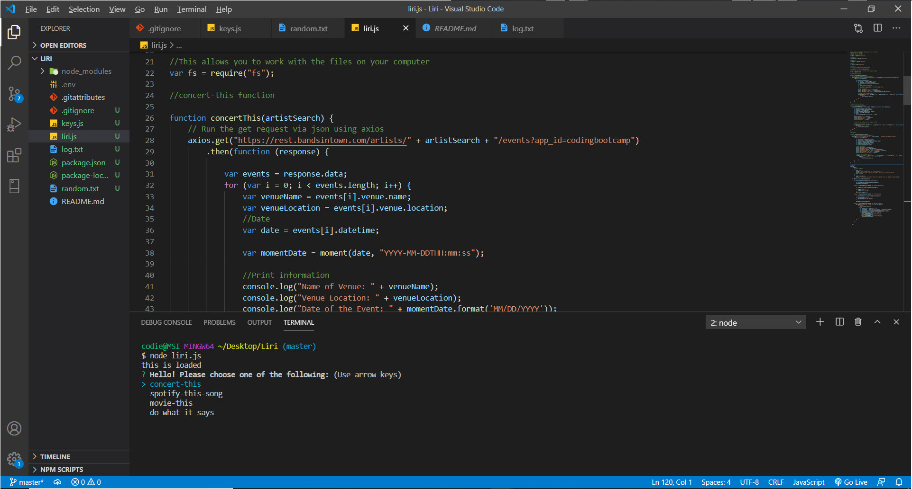
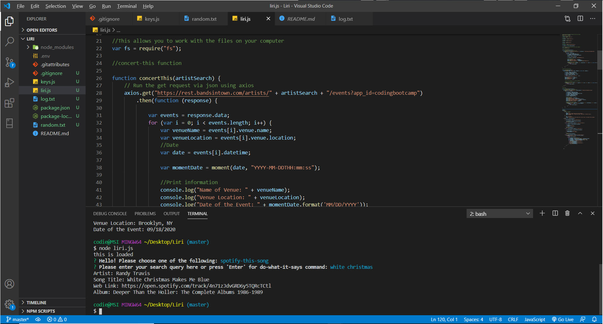
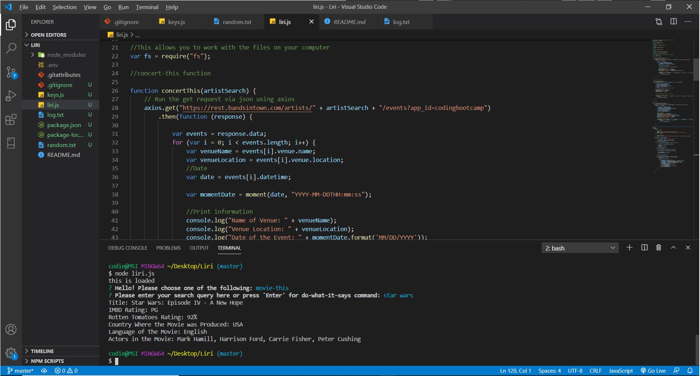

# Liri

Liri is a texted-based command-line Node application that takes in queries via Inquierer.
Using the Spotifiy API, Bands in Town API, and OMDB API it pulls the information based on the query
and provides it to the user via the terminal.

 
